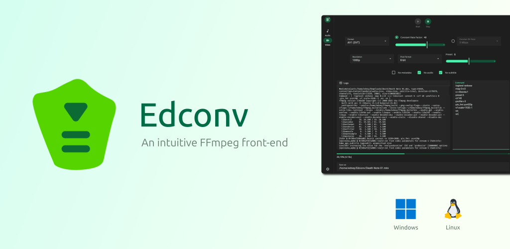

<div align="center">
  <h1>Edconv</h1>

**Edconv** is a user-friendly interface that simplifies the power of **FFmpeg**. It's designed for fast and efficient conversion of video and audio files.


[](https://github.com/edneyosf/Edconv/actions/workflows/linux-build.yml)
[](https://github.com/edneyosf/Edconv/actions/workflows/windows-build.yml)

<h4>Download</h4> 
<a href="https://github.com/edneyosf/Edconv/releases">
  
</a>
</div>

## Features ✨

- Convert video and audio using FFmpeg
- Presets for movies, shows, and music (soon)
- Custom FFmpeg arguments
- Clean, intuitive interface

## Screenshots


## Requirements

- [FFmpeg](https://ffmpeg.org/download.html) must be installed and accessible in your system
- On first launch, Edconv will prompt you to select your local FFmpeg binary

## Installation

Download the latest release for your system from the [Releases page](https://github.com/edneyosf/edconv/releases):

#### Debian-based systems:  
```bash
sudo dpkg -i edconv_x.x.x.deb
```

#### RPM-based systems:
```bash
sudo dnf install edconv_x.x.x.rpm
```

#### Windows:  

Run the installer as administrator and follow the installation steps.

## Support & Donations

Special thanks to all supporter ❤️

<a href="https://buymeacoffee.com/edneyosf">
  
</a>
