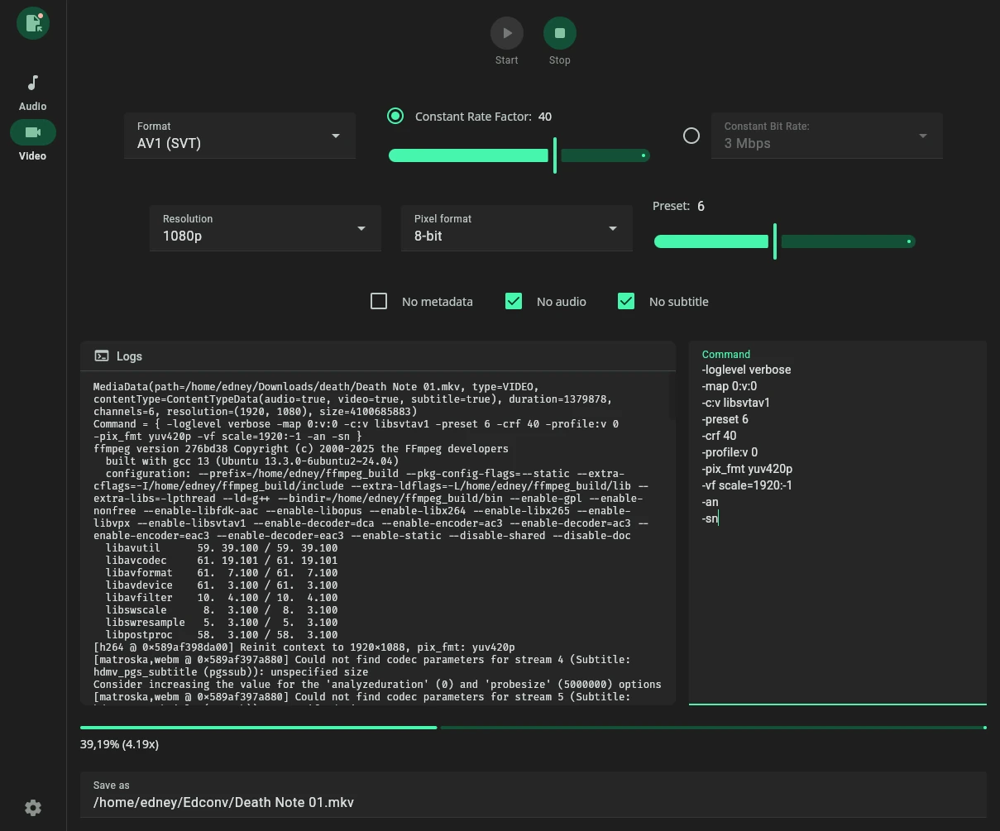

# Edconv

[](https://github.com/edneyosf/Edconv/actions/workflows/linux-build.yml)
[](https://github.com/edneyosf/Edconv/actions/workflows/windows-build.yml)

**Edconv** is a user-friendly interface that simplifies the power of **FFmpeg**. It's designed for fast and efficient conversion of video and audio files.



---

## 🚀 Features

- 🎥 Convert video and audio using FFmpeg
- 🎛️ Presets for movies, shows, and music (soon)
- ⚙️ Custom FFmpeg arguments
- 🖥️ Clean, intuitive interface

---

## ⚠️ Requirements

- [FFmpeg](https://ffmpeg.org/download.html) must be installed and accessible in your system
- On first launch, Edconv will prompt you to select your local FFmpeg binary

---

## 🔧 Installation

Download the latest release for your system from the [Releases page](https://github.com/edneyosf/edconv/releases):

#### Debian-based systems:  
```bash
sudo dpkg -i edconv_x.x.x.deb
```

#### Windows:  

Run the installer as administrator and follow the installation steps.

---

## 📖 License

This project is licensed under a custom MIT-based **Non-Commercial License**.  
Commercial use and redistribution for profit are not allowed.  
See the [LICENSE](./LICENSE) file for full terms.

---

<a href="https://buymeacoffee.com/edneyosf">
  
</a>
