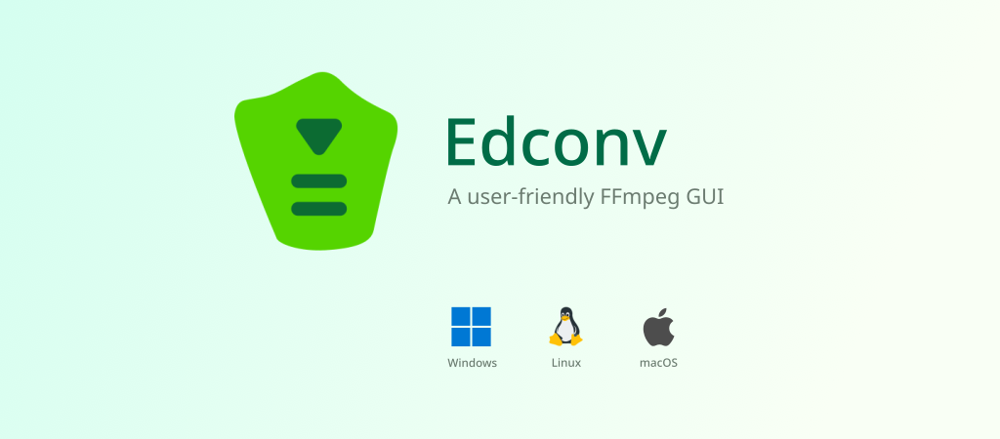

<div align="center">
  <h1>Edconv</h1>

A user-friendly interface that simplifies the power of **FFmpeg**. It's designed for fast and efficient conversion of video and audio files.

  <a href="https://github.com/edneyosf/Edconv/releases"></a>
  <a href="https://github.com/edneyosf/Edconv/releases"></a>

  <a href="https://github.com/edneyosf/Edconv/actions/workflows/linux-build.yml"></a>
  <a href="https://github.com/edneyosf/Edconv/actions/workflows/windows-build.yml"></a>
  <a href="https://github.com/edneyosf/Edconv/actions/workflows/windows-build.yml"></a>

  <h4>Download</h4> 
  <a href="https://github.com/edneyosf/Edconv/releases">
    
  </a>
</div>

## Features ✨

- You can convert video and audio using FFmpeg
- You can queue multiple jobs and watch them process in real time
- You can pass custom FFmpeg arguments if you want full control
- You still see all the logs (so you know exactly what’s happening)
- You can convert video and audio using FFmpeg
- You can see all the media information
- You can run VMAF, PSNR, SSIM analysis right inside the app

> **⚠️ Notice**
>
> To use VMAF, it must be enabled in the FFmpeg binaries.

## Screenshots


## Requirements

[FFmpeg](https://ffmpeg.org/download.html) must be installed and accessible in your system, we also provide GPL-licensed binaries in our releases, **recommended to use version 7.1 or higher**.

On first launch, Edconv will prompt you to select your local FFmpeg binary.

## Installation

Download the latest release for your system from the [Releases page](https://github.com/edneyosf/edconv/releases):

### Windows:

Run the installer as administrator and follow the installation steps.

### macOS:

Run the installer and follow the installation steps.

### Flatpak

> **⚠️ Notice**
>
> The Flatpak version of this application **does not have access to system libraries**.  
> As a result, **FFmpeg and FFprobe binaries must be compiled with static libraries** to work correctly within the sandbox environment.

```bash
flatpak --user install Edconv-x.x.x-x86_64.flatpak
```

```bash
flatpak run io.github.edneyosf.edconv
```

### AppImage

Before running the AppImage, ensure it has execution permissions.

```bash
chmod +x Edconv-x.x.x-x86_64.AppImage
```

```bash
./Edconv-x.x.x-x86_64.AppImage
```

### Debian-based systems:  
```bash
sudo apt install ./Edconv_x.x.x-86_64.deb
```

## Support & Donations

Special thanks to all supporter ❤️

<a href="https://buymeacoffee.com/edneyosf">
  
</a>